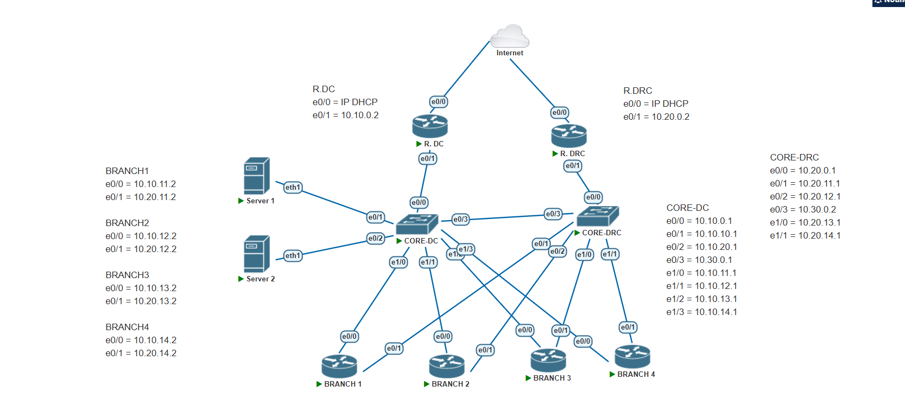
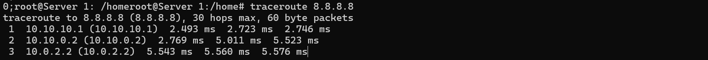
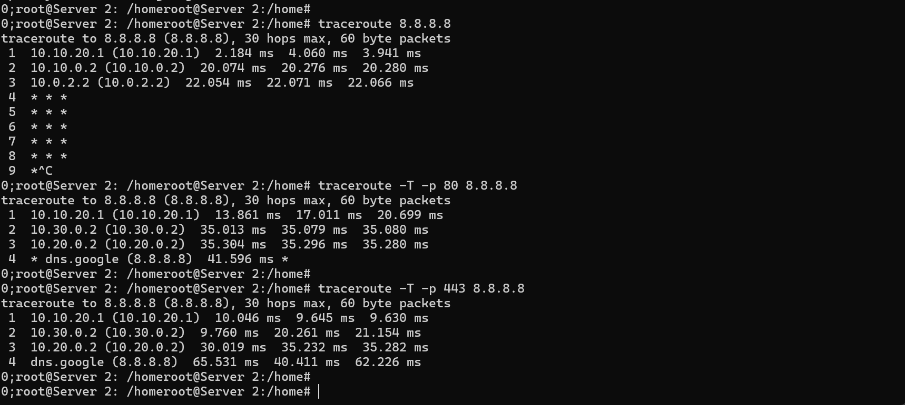
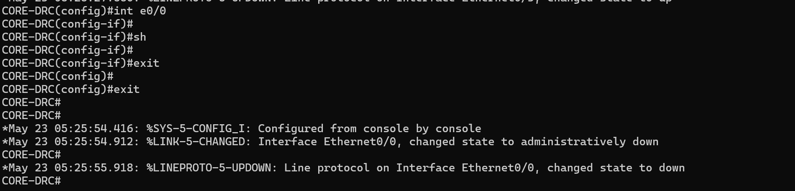
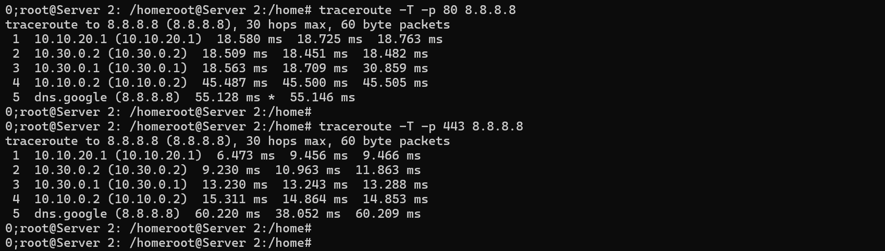

# Implementasi Policy-Based Routing (PBR) dengan ACL pada Infrastruktur Jaringan Menggunakan PNETLab

## Project Overview
Proyek ini bertujuan untuk mengoptimalkan alur trafik pada jaringan perusahaan yang memiliki infrastruktur **Data Center (DC Active)** dan **Disaster Recovery Center (DRC Backup)**. 

Masalah utama yang diselesaikan adalah keterbatasan routing konvensional yang hanya mempertimbangkan alamat tujuan. Dengan mengombinasikan **Policy-Based Routing (PBR)** dan **Access Control List (ACL)**, trafik diarahkan berdasarkan **Source IP** dan **Tipe Protokol/Aplikasi (Port)**.

## Network Topology

*Gambar: Arsitektur Jaringan pada PNETLab*

### Infrastructure Details:
*   **Core DC (Multilayer Switch):** Konfigurasi Policy Based Routing (PBR) dan ACL diterapkan pada node ini. Seluruh keputusan pemilahan trafik dilakukan oleh Multilayer Switch ini.
*   **Core DRC (Multilayer Switch):** Berfungsi sebagai jalur transit dan distribusi trafik yang telah dibelokkan oleh Core DC.
*   **Router Internet DC (R.DC):** Berfungsi sebagai gerbang keluar utama melalui ISP jalur DC.
*   **Router Internet DRC (R.DRC):** Berfungsi sebagai gerbang keluar sekunder melalui ISP jalur DRC.
*   **Router Branch 1-4:** Representasi kantor cabang yang terhubung ke pusat. Bertugas meneruskan trafik user menuju Core DC.
*   **End Devices (VLAN 10 & 20):** Perangkat yang digunakan untuk pengujian PBR dan ACL.

## Policy-Based Routing (PBR) Rules
Logika pengalihan trafik dirancang sebagai berikut:

| Seq | Kategori | Match Criteria (ACL) | Next-Hop | Keterangan |
|:---:|:---|:---|:---|:---|
| 10 | Eksekutif | VLAN 10 (Seluruh Trafik) | 10.10.0.2 (R.DC) | Jalur Prioritas |
| 20 | Staff Web | VLAN 20 (TCP 80, 443) | 10.30.0.2 (Core DRC) | Web Offloading |
| 30 | Staff Other | VLAN 20 (ICMP/Lainnya) | Routing Table | Jalur Default (DC) |

---

## Configuration Highlights (Core DC)

### 1. Klasifikasi Trafik (ACL)
```bash
! ACL 100: Mengizinkan seluruh trafik dari segmen Executive (VLAN 10)
access-list 100 permit ip 10.10.10.0 0.0.0.255 any

! ACL 101: Memilih hanya trafik Web (HTTP/HTTPS) dari segmen Staff (VLAN 20)
access-list 101 permit tcp 10.10.20.0 0.0.0.255 any eq www
access-list 101 permit tcp 10.10.20.0 0.0.0.255 any eq 443
```
### 2. Route-Map
`Route-map` berfungsi sebagai pembuat keputusan jalur mana yang akan diambil setelah trafik cocok dengan ACL.

```bash
! Urutan 10: Jika cocok ACL 100 (Executive), arahkan ke Next-Hop DC (10.10.0.2)
route-map PBR permit 10
 match ip address 100
 set ip next-hop 10.10.0.2

! Urutan 20: Jika cocok ACL 101 (Staff Web), arahkan ke Next-Hop DRC (10.30.0.2)
route-map PBR permit 20
 match ip address 101
 set ip next-hop 10.30.0.2

! Urutan 30: Mengizinkan trafik lainnya tetap mengalir sesuai tabel routing normal
route-map PBR permit 30
```
### 3. Implementasi pada SVI & Floating Static Route
Kebijakan PBR diterapkan pada interface gateway (SVI), serta jalur cadangan menggunakan floating static route.

```bash
! Menerapkan kebijakan PBR pada Gateway masing-masing VLAN
interface Vlan10
 ip policy route-map PBR
!
interface Vlan20
 ip policy route-map PBR

! Floating Static Route untuk Failover (AD 100)
! Jika jalur utama (10.10.0.2) mati, rute AD 100 akan aktif otomatis.
ip route 0.0.0.0 0.0.0.0 10.10.0.2
ip route 0.0.0.0 0.0.0.0 10.30.0.2 100
```
---

## Testing & Verification

Pengujian dilakukan dari End-Device (Server) untuk memverifikasi ketepatan implementasi kebijakan PBR berdasarkan skenario trafik.

### 1. Skenario 1: Executive Traffic (VLAN 10)
*   **Target:** Memastikan seluruh trafik dari Executive diarahkan ke jalur DC Active.
*   **Metode:** Pengujian `traceroute` standar dari end device VLAN 10 ke arah internet (8.8.8.8).
*   **Analisis:** Hop ke-2 menunjukkan IP `10.10.0.2` (Router DC Active).
*   
*Gambar: Pengujian 1*

### 2. Skenario 2: Staff Web Offloading (VLAN 20)
*   **Target:** Memastikan trafik Web (HTTP/HTTPS) dari Staff dialihkan ke jalur DRC Backup.
*   **Metode:** Menggunakan perintah `traceroute -T -p 80` dan `traceroute -T -p 443` untuk menyimulasi trafik HTTP.
*   **Analisis:** Trafik berhasil diidentifikasi oleh ACL 101 dan dibelokkan menuju **CORE-DRC (10.30.0.2)**.
*   
*Gambar: Pengujian 2*

### 3. Skenario 3: Staff Other Traffic (ICMP)
*   **Target:** Memastikan trafik non-web seperti ICMP tetap mengikuti jalur routing normal.
*   **Metode:** Pengujian `traceroute` (ICMP) dari end device VLAN 20.
*   **Analisis:** Karena PBR hanya untuk trafik yang menuju port TCP 80/443, maka trafik ICMP (Ping/Traceroute) tetap mengikuti jalur routing normal (lewat DC).
*   
*Gambar: Pengujian 3*
### 4. Skenario 4: Failover
*   **Target:** Memastikan ketersediaan jaringan dan pengalihan trafik otomatis jika jalur DRC mengalami gangguan.
*   **Metode:** Mematikan interface yang menuju ke arah CORE-DRC dan melakukan pengujian `traceroute -T -p 80` dan `traceroute -T -p 443` kembali dari VLAN 20.
*   **Hasil:** PBR mendeteksi jalur tidak tersedia, sehingga trafik secara otomatis melakukan *fallback* ke jalur DC melalui *Floating Static Route* (AD 100).
*   
*   
*Gambar: Pengujian 4*
---

## Lab Setup Instructions

Untuk menjalankan simulasi ini di lingkungan PNETLab:

1.  **Topology:** Import file `.unl` yang berada di folder `topology/`.
2.  **Images:** Gunakan **Cisco IOL** (`i86bi-linux-l3-ipbase-12.4.bin` atau versi serupa).
3.  **Configurations:** 
    *   Seluruh konfigurasi *startup* perangkat tersedia di folder `Konfigurasi/configs`.
    *   Pastikan melakukan perintah `write memory` pada setiap node.
4.  **Verification:** Gunakan terminal pada Server 1 & 2 untuk melakukan `traceroute` dengan parameter port untuk memicu ACL.

## Team Members
1. Raihan Faiz Ramadhan
2. Eka Prasetya A. N
3. Rizki Putra
4. M. Andhika Abellyosa
5. Angellina Putri Cetra Adellia
6. M. Rizki Saputra 
